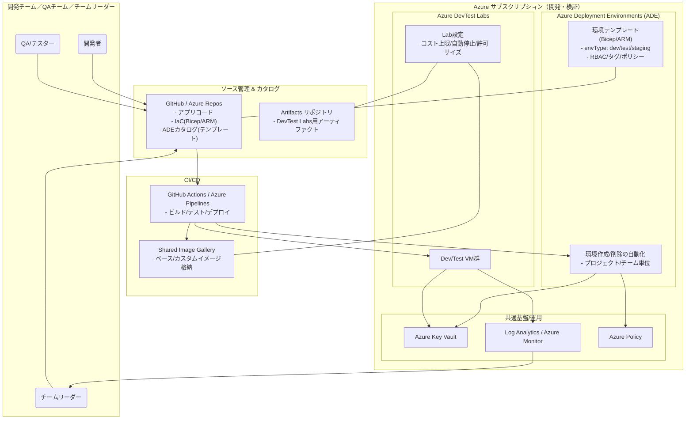
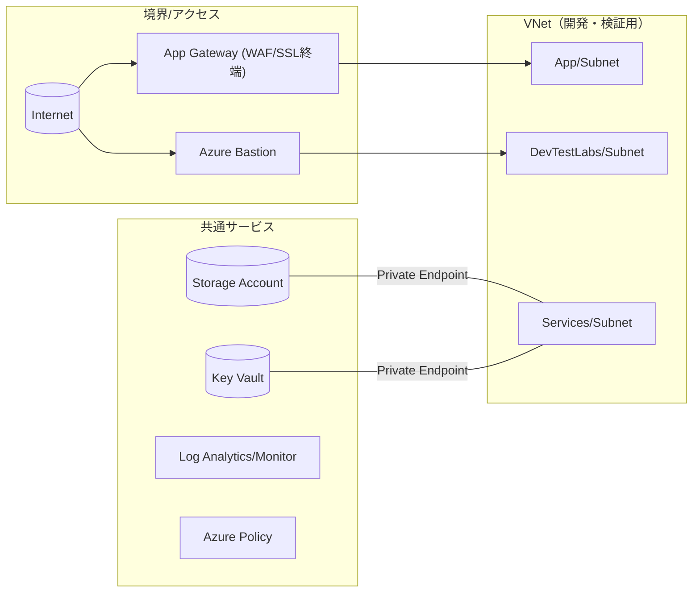

# CI/CD 環境ガイド

## 背景・目的

現代の開発ワークフローには、ハードウェアやソフトウェアツールだけでなく、**規約とそれを強制するツール・環境**が必要です。
AI以前のワークフローとして、CI/CDパイプラインとステージング環境の整備が先決事項です。

## 用語

| 用語 | 定義 |
|:---|---|
| ビルド | ワークスペースから成果物を生成すること。一般的にはコンパイル等が行われる |
| CI | 継続的インテグレーション |
| CD | 継続的デリバリ |
| テスト | 正常性を確認するためのスクリプト等で、tapまたはxunit形式で出力されるもの。自動テストとも記述する |
| ステージング | テストでとらえられない性質の不具合を人によるUIを通じて確認するための環境。手動テストとも記述する |

## CIのプロセス

### トリガ
コミット時（ローカルでコミットしたものをGitHubへプッシュ）。
コミットにより、GitHub ActionsやCircle CIなどが起動され、CIプロセスが実行される。

### ビルド
CIプロセスの最初の工程。CIフレームワークによりビルド環境が作成され、ビルドが行われる。
典型的には `make test` などが実行される（`make test` では通常、`make all` した後にテストが実行されるよう Makefile を構成する）。

### テスト
ビルドプロセスの最終工程。テスト自体は自動で行われ、結果がtapまたはxunit形式で出力される。
UIのテストについても結果をtapなどで出力する必要があるため、ウェブアプリなどでは開発フレームワークに応じたテストを利用してヘッドレスでテストすることが求められる。
自動テストを定義できないものでCIをしたい場合はビルドのみとなる。

### デプロイ
CIフレームワークはテストがOKだった場合にデプロイする。

- **自動デプロイの場合**: mainへのプルリクエストとしてチケット作成
- **手動デプロイの場合**: stageへのプルリクエストとしてチケットを作成

## CDのプロセス

mainへのプルリクエストのメタ情報をもとに、デリバリ方針が決まる。

### 自動デプロイの場合
プルリクエストは自動マージされ、その結果としてデプロイされる。

### 承認付デプロイの場合
（承認フローが必要な場合にここへ追記）

## ステージング環境とその意義

CIでとらえられない性質の不具合の有無を、人によるUIを通じて確認するための環境。
ロボットなどでテストするものはステージングとしては扱わない。

CI/CDの観点では、ステージングへ分岐するとパイプラインが分断される（ステップ駆動となる）。

**バージョンアップ種別ごとの規約例：**

| バージョン種別 | 要求条件 |
|---|---|
| マイクロ | 自動テストグリーン → 本番に直接デプロイ |
| マイナー | 自動テストグリーン → ステージングでビルドグリーン → 本番デプロイ |
| メジャー | 自動テストグリーン → ステージングで手動テスト → releaseコミット → デプロイボタン |

## Azure 開発・検証環境の全体像

ADE（Azure Deployment Environments）はプロジェクト・環境タイプ（dev/test/staging）ごとにテンプレートからリソースを一括作成し、タグ/RBAC/ポリシーでガバナンスを管理します。
DevTest Labsは開発者がセルフサービスでVMを迅速に払い出せる仕組み（コスト制御・自動停止・アーティファクトによる初期構成自動化）を提供します。

### ネットワーク構成

Private EndpointでStorage/Key VaultへのアクセスをVNet内に閉じ、NSG/UDRでトラフィックを制御。
BastionによりRDP/SSHを公開せずVMへ安全にアクセスできます。

## 参考：Azure サービス比較

| サービス | 用途 | 状態 |
|---|---|---|
| Azure DevTest Labs | 開発・テスト用VM払い出し、コスト管理、アーティファクト適用 | 利用可 |
| Windows 365 | フル機能クラウドPC、エンタープライズポリシー強制 | 利用可 |
| DevBox | 開発者向けクラウドPC | Windows 365へ吸収予定 |
